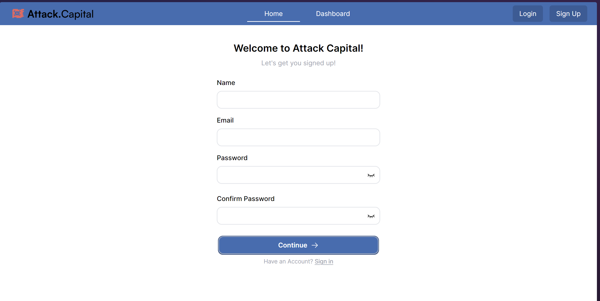
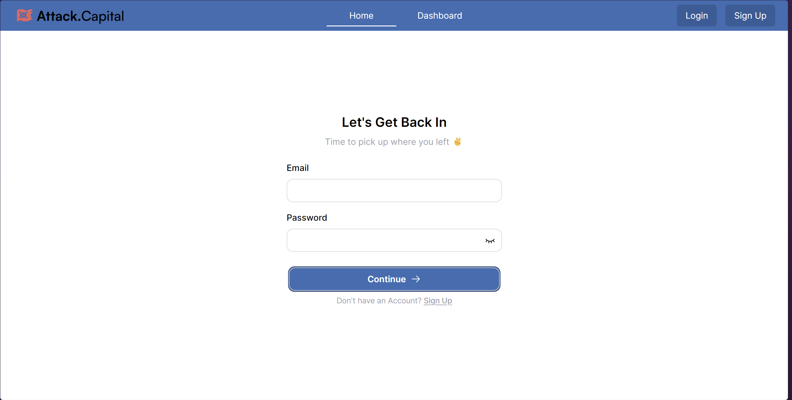
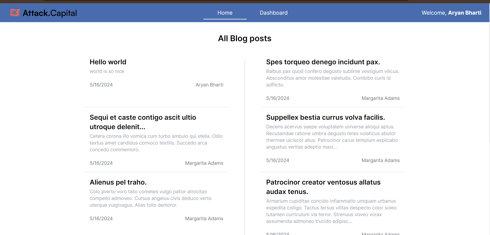
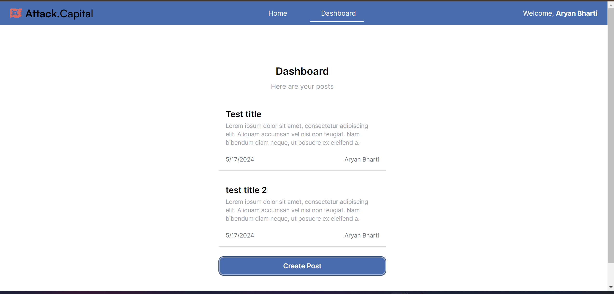
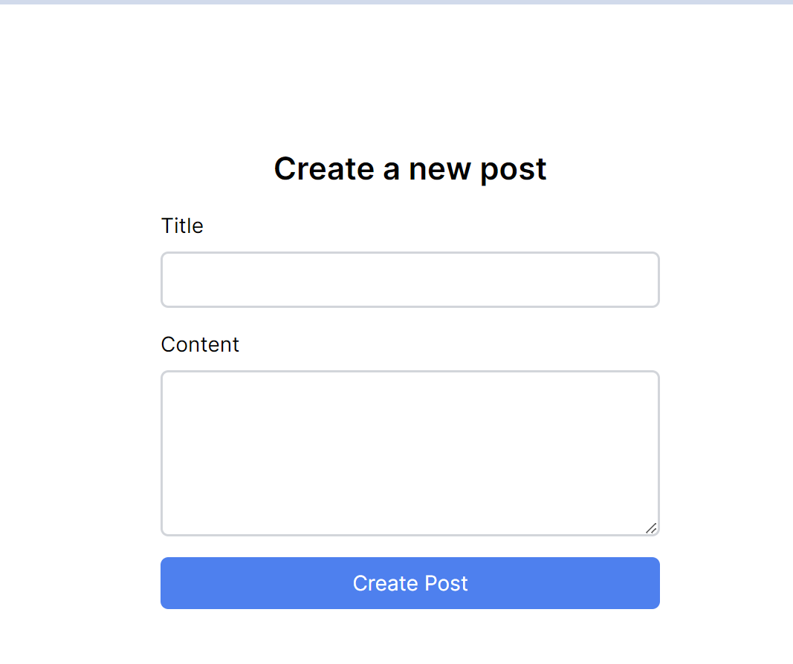

# Attack Capital Fullstack Internship Task

Hosted at [attack-capital.aryanbharti.com](https://attack-capital.aryanbharti.com/)

## Overview

Welcome to Attack Capital's Fullstack Internship Task! This repository contains the codebase for the personal blog platform developed as part of the task. The platform allows users to sign up, log in, and post blog posts. Users can view all posts and filter them by author. The backend is built using Node.js and Express, while the frontend uses Next.js 14 with TypeScript.
 
## Task Description

Develop a personal blog platform where users can sign up, log in, and post articles. The platform should allow users to view all posts and filter them by author. The backend should be built using Node.js and Express, and the frontend should use Next.js 14 with TypeScript.

## Technologies Used

#### Frontend

- **Language:** TypeScript
- **Framework:** Next.js
- **CSS Framework:** Tailwind CSS

#### Backend

- **Language:** Typescript
- **Web Framework:** Express
- **ORM:** Mongoose and IORedis
- **Databases:** MongoDB (main database), Redis (caching)

#### Getting Started with Roles

1. After running both Docker containers, you need to sign in.

## Usage

To utilize the Attack Capital personal blog website, follow these steps:

#### - Clone the Repository

```bash
git clone https://github.com/woaitsAryan/attack-capital-task
cd attack-capital-task
```

#### - Run the docker commands in both the folders
Navigate to the respective directories and execute the following Docker commands: 

```bash
sudo docker compose build
sudo docker compose up -d
```

**( refer the respective running frontend and backend sections )**


# Web Interface (Frontend)

## Environment Variables

Copy the `env.sample` file to `.env` and customize it according to your needs. This file contains environment variables used by the frontend.

## Running the Frontend

To run the Attack Capital frontend, follow these steps:

1. Ensure you have Docker installed on your system.

2. Open a terminal and navigate to the root directory of the frontend.

3. Copy env from  *env.sample* and make changes only if necessary.
    ```bash
    sudo nano .env
   ```

4. Run the following commands:

    ```bash
    sudo docker compose build
    sudo docker compose up
    ```
    or
    ```bash
    npm i -g pnpm
    pnpm install
    pnpm run build
    pnpm run start
    ```

5. The application will be accessible at `http://localhost:3000` by default.

## Screenshots

*Sign Up*



*Login*



*Home page view*



*Dashboard view*



*Create Post view*



# API (Backend)

[](https://app.getpostman.com/run-collection/28268592-c963ba1a-bcb4-4f07-9a33-bac98e77ede0?action=collection%2Ffork&source=rip_markdown&collection-url=entityId%3D28268592-c963ba1a-bcb4-4f07-9a33-bac98e77ede0%26entityType%3Dcollection%26workspaceId%3D0dcfcac8-bfba-41a0-b8b9-2271625f7a6a)

## Endpoints

### 1. Get All Blog posts

- **Endpoint:** `GET /posts`
- **Description:** Retrieve all posts
- **Query Parameters:**
  - `page`: Page number for paginated queries (default: 1).
  - `limit`: Number of posts per page in paginated queries (default: 10).
  - `author`: Fetch posts of a specific author
- **Sample Request**
    `/?page=1&limit=10`
  <small>*- Multiple queries are supported*</small>
- **Response Format:**
  ```json 
    {
      "posts": [
        {
            "_id": "664620a7e934454efc292810",
            "title": "Tutamen.",
            "content": "Terga thymbra defetiscor.",
            "authorId": {
                "_id": "664620a7e934454efc2927fb",
                "email": "Aron61@hotmail.com",
                "name": "Margarita Adams"
            },
            "createdAt": "2024-05-16T15:05:11.771Z",
        },
        // Additional posts
      ]
  }
  ```


### 2. Create a post

- **Endpoint:** `POST /posts`
- **Description:** Add a new post to the database.
- **Request Format:**
  ```json
  {
    "title":"Sample title",
    "content": "some content lorem ipsum yes"
  }

- **Response Format:** The response from the `POST /` endpoint is in JSON format and follows the structure below:

    ```json
    {
    "message": "Post created",
    "post": {
        "_id": "664738b116ed8cfbef8e2740",
        "title": "Sample title",
        "content": "some content lorem ipsum yes",
        "authorId": "6645ec717c00ecf279d8a7c9",
        "createdAt": "2024-05-17T11:00:01.326Z",
        "__v": 0
    }
    }

### 3. Sign Up

- **Endpoint:** `POST /auth/signup`
- **Description:** Create a new user.
- **Request Format:**
  ```json
  {
    "email":"workaryanbharti1@gmail.com",
    "password": "password12345",
    "name":"Aryan Bharti"
  }

- **Response Format:** The response from the `POST /auth/signup` endpoint is in JSON format and follows the structure below:

    ```json
    {
      "token": "jwt_token",
      "message": "Account successfully registered!",
      "name": "Aryan Bharti",
    }
    ```

### 6. Login

- **Endpoint:** `POST /auth/login`
- **Description:** Login route.
- **Request Format:**
  ```json
  {
    "email":"workaryanbharti2@gmail.com",
    "password": "password12345"
  }

- **Response Format:** The response from the `POST /auth/login` endpoint is in JSON format and follows the structure below:

    ```json
    {
     "token": "jwt_token",
    "message": "Successfully logged in!",
    "name": "Aryan Bharti"
    } 

## Caching

Redis is utilized for caching in this system. The filters used in queries are used as the key for the Redis storage. This approach ensures that redundant queries for the same filter do not incur additional processing time. The Redis storage also considers pagination, using the default limit of 10.

## Environment Variables

A sample of the environment file is provided in the root directory of the backend, named `.env.sample`.

## Running the Backend

To run the Attack Capital Backend, follow these steps:

1. Ensure you have Docker installed on your system.

2. Open a terminal and navigate to the root directory of the backend.

3. Copy env from  *env.sample* and make changes only if necessary.
    ```bash
    sudo nano .env
   ```

4. Run the following commands:

    ```bash
    sudo docker compose build
    sudo docker compose up
    ```
    or
    ```bash
    pnpm install
    pnpm run build
    pnpm run start
    ```

5. The application will be accessible at `http://localhost:3000` by default.

6. You can seed the database with dummy blog posts using `pnpm run seed` or node scripts/seed.js if built

Best Regards,
Aryan Bharti